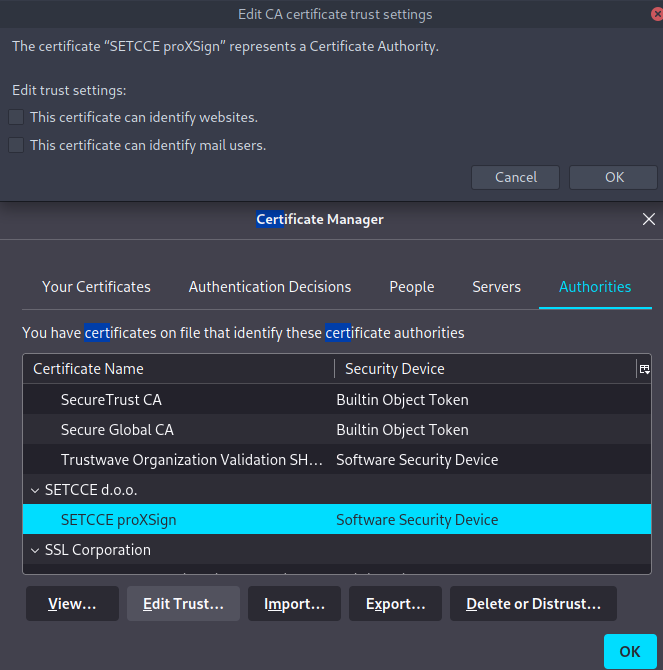

# [proxsign](https://github.com/xtruder/docker-images/pkgs/container/proxsign)

[](https://github.com/xtruder/docker-images/pkgs/container/proxsign)

proxsign running in docker container

## About

Minimal [proxsign](https://www.si-trust.gov.si/sl/podpora-uporabnikom/podpisovanje-s-komponento-proxsign/)
app running in container. It is used for signing documents for Slovenian government, and you
probably don't need it. I decided to create docker image, because getting this service to
run on linux is kind of painful

## Running

### Create temporary firefox home with imported `SI-TRUST` cert

- Run firefox undef different home:

```shell
HOME=$PWD/proxsign firefox
```

- Now import your `SI-TRUST` cert.

### Create proxsign container with mozilla home

```shell
podman create -p 14900:5900 -p 14972:14972 --name proxsign localhost/proxsign:latest
podman cp proxsign/.mozilla proxsign:/home/proxsign
podman start proxsign
```

### Connect via VNC

Proxsign is a QT application and we have set for QT to use VNC backend for its windows.
Connect via VNC to `localhost:14900` and check if proxsign has successfully imported
yout `SI-TRUST` cert.

### Add security exception for `localhost:14972`

Visit `https://localhost:14972` and add security exception for `proxsign`
selfsigned cert. If you will recreate container, you will need to add
security exception again.

If you can't add security exception it's probably because your browser has SETCE
certificates installed and they will clash with certificates created by proxsign.
Solution is to remove disable trust for `SETCE proXSign` certificates.



## Signing documents

To test sign your documents visit https://www.si-trust.gov.si/sl/podpora-uporabnikom/podpisovanje-s-komponento-proxsign/preizkus-podpisovanja-s-podpisno-komponento/
and click sign. At the same time you will also need to connect via VNC to
`localhost:14900` to approve signing request.

If you have issues, make sure you have added security exception for `https://localhost:14972`
and that your certificate is visible in proxsign interface.